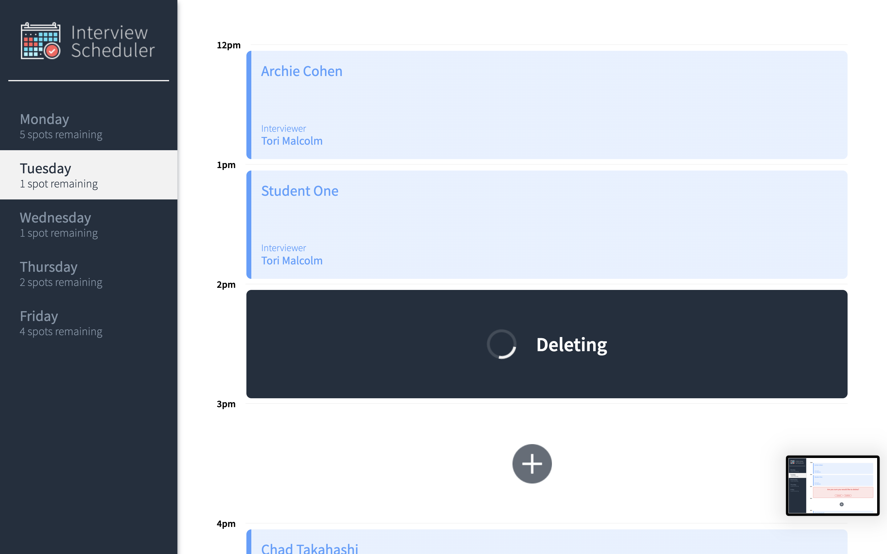

# Interview Scheduler

The Interview Scheduler is a modern and user-friendly Single Page Application (SPA) designed to manage and monitor student interviews. It incorporates the latest tools and techniques to provide an optimized user experience. With this application, users can easily add, modify, and delete interview appointments in real time. It leverages React's built-in and custom hooks to handle data efficiently. The application's data is stored and persisted by a PostgreSQL database through an API server. Communication between the client application and the API server occurs over HTTP, utilizing the JSON format. To ensure high quality, the project adheres to the best practices of Test Driven Development (TDD). This includes conducting thorough testing of individual components in isolation, as well as performing comprehensive End-to-End testing.

## Main Features

* Display appointment days (Monday to Friday) showing the number of available slots for each day.
* Allow users to switch between days and view detailed information.
* Enable users to book interviews by entering a student name and selecting an interviewer from a list.
* Provide the option for users to modify the details of an existing interview by clicking the edit icon.
* Allow users to cancel existing interviews, with a pop-up message for confirmation before permanent deletion.

## Setup

Install dependencies with `npm install`.

## Running Webpack Development Server

```sh
npm start
```

## Running Jest Test Framework

```sh
npm test
```

## Running Storybook Visual Testbed

```sh
npm run storybook
```

## Screenshots

Daily View
 

Appointement Form


Confirmation when saving an appointment


Deleting an appointment


Deleting Status


Spots Update


## Running the app locally
1.Fork and clone this repo to your local machine.

2.Go to the scheduler-api repo here: <https://github.com/lighthouse-labs/scheduler-api> fork and clone this repo.

3.Install dependencies in both folders (scheduler & shceduler-api) using the npm install command.

4.Open two terminals, one will be running our application scheduler and the second one will be running the database "scheduler-api".

5.Start both servers using npm start command.

6.Go to http://localhost:8000/ in your browser and enjoy the app.
 
## Dependencies
    "axios": "^0.20.0",
    "classnames": "^2.2.6",
    "normalize.css": "^8.0.1",
    "react": "^16.9.0",
    "react-dom": "^16.9.0",
    "react-scripts": "3.4.4"
    "@babel/core": "^7.4.3",
    "@storybook/addon-actions": "^5.0.10",
    "@storybook/addon-backgrounds": "^5.0.10",
    "@storybook/addon-links": "^5.0.10",
    "@storybook/addons": "^5.0.10",
    "@storybook/react": "^5.0.10",
    "@testing-library/jest-dom": "^4.0.0",
    "@testing-library/react": "^8.0.7",
    "@testing-library/react-hooks": "^8.0.1",
    "babel-loader": "8.1.0",
    "prop-types": "^15.8.1",
    "react-test-renderer": "^16.9.0",
    "sass": "^1.53.0"
